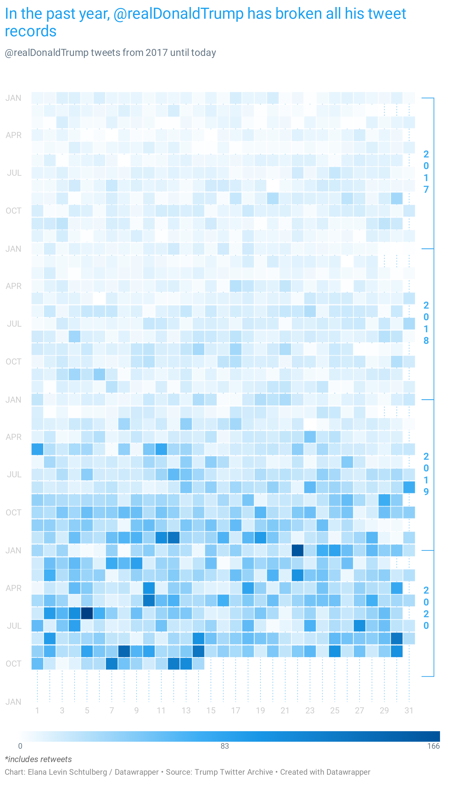

# Create a Datawrapper scatterplot heatmap of @realDonaldTrump's tweets

This is a collection of node.js scripts for pulling data from the [Trump Twitter Archive](https://trumptwitterarchive.com), and creating the following chart, which was published on the Datawrapper Blog as a Weekly Chart ([here](https://blog.datawrapper.de/weekly-chart-trump-tweet-heatmap/) for the original article)



### Prerequisites

You need to have [node.js](https://nodejs.org/en/) and [npm](https://www.npmjs.com/) installed on your system in order to run these scripts.

### How to use these scripts

To download the data and create your own version of this chart, you'll need to:

**1. Install required packages by running:**
```
npm install
```

**2. Configure API Token**

- Make a copy of the .env-template file, and add your Datawrapper API Token, so that it looks something like this:

```
API_TOKEN=XXXXXXXXXXXXXXXXXXXXXXXXXX
```

- Then save the file with the name `.env`.

(If you don't have an API token, you can read up on how to set one up [here](https://developer.datawrapper.de/docs))

**2. To pull the latest data and create a chart, run:**

```
npm run all
```

(If you want to update the data in an existing chart, do `npm run all` with your chart ID afterwards)

**This will:**

1. Pull the latest data from [Trump Twitter Archive](https://trumptwitterarchive.com)
2. Collect and save some stats
3. Summarise the tweets into daily data
3. Generate the CSV for your chart
4. Create (or update) your Datawrapper chart

### The individual scripts

You can also run individual scripts, instead of all of them:

- [get-tweets](https://github.com/datawrapper/snippets/blob/master/2020-10-18-trump-tweet-heatmap/get-tweets.js) Will download the latest tweets, and add them to the `all-tweets.json` file.
- [get-stats](https://github.com/datawrapper/snippets/blob/master/2020-10-18-trump-tweet-heatmap/get-stats.js) Will extract some key information on use of certain words, total number of tweets, etc. And save this information to the `tweet-stats.json` file.
- [count-tweets](https://github.com/datawrapper/snippets/blob/master/2020-10-18-trump-tweet-heatmap/count-tweets.js) Will get the daily tweet totals, pulling from the `all-tweets.json` file. This will also get the information about the most popular tweet of that each day. This gets saved to the file `daily-tweets.json`
- [create-heatmap](https://github.com/datawrapper/snippets/blob/master/2020-10-18-trump-tweet-heatmap/create-heatmap.js) This will create a Datawrapper heatmap like the image above out of the data in your `daily-tweets.js` file. (it also saves the CSV to `chart-data.csv`)

Run any of these scripts with `node script-name.js`.
